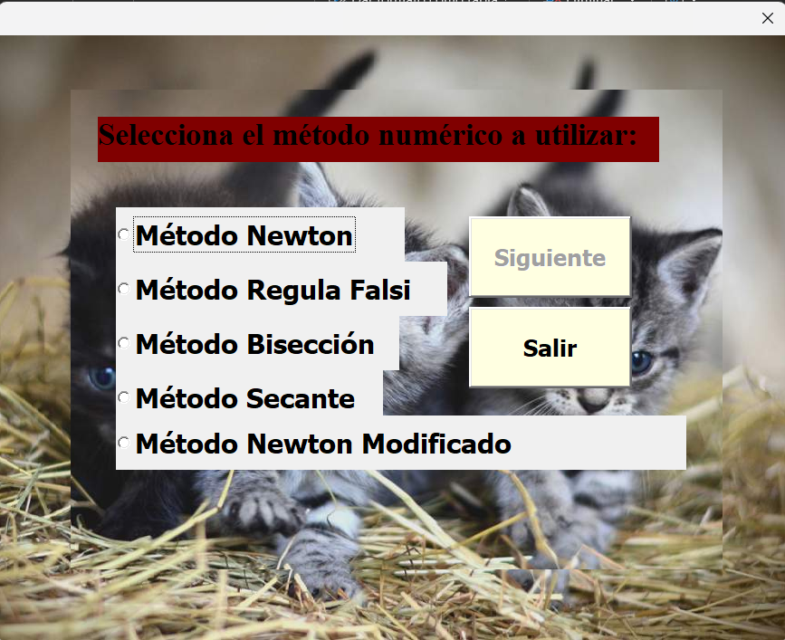

# 🧮 Métodos Numéricos en Excel (VBA)

Este repositorio contiene un libro de Excel habilitado para macros (`Metodos interfaz.xlsm`) que implementa una completa suite de algoritmos de métodos numéricos. Está diseñado para encontrar las raíces de ecuaciones matemáticas complejas a través de una interfaz amigable (UserForm), aprovechando el poder de cómputo y automatización de Visual Basic para Aplicaciones (VBA).

## 🚀 Características Principales

El proyecto permite al usuario seleccionar entre cinco algoritmos fundamentales para el análisis numérico, adaptables según el comportamiento de la función analizada:

* **Método de Bisección:** Un método cerrado y robusto que divide repetidamente un intervalo a la mitad para aislar la raíz de manera segura.
* **Método Regula Falsi (Regla Falsa):** Un método cerrado alternativo que aproxima la raíz trazando una línea recta entre los valores de la función en los extremos del intervalo, optimizando el tiempo de convergencia frente a la bisección.
* **Método de Newton (Newton-Raphson):** Un método abierto altamente eficiente que utiliza la primera derivada de la función para trazar rectas tangentes y encontrar aproximaciones sucesivas de forma rápida.
* **Método de la Secante:** Una variación de los métodos abiertos que aproxima la derivada trazando una recta secante a través de dos puntos anteriores. Es ideal para funciones donde calcular la derivada analítica es muy complejo.
* **Método de Newton Modificado:** Una versión avanzada diseñada específicamente para lidiar con raíces múltiples o funciones donde la derivada primera se acerca a cero, utilizando información adicional (frecuentemente la segunda derivada) para garantizar la convergencia.

## 🛠️ Requisitos Previos

Para ejecutar esta herramienta correctamente, necesitas:
* Microsoft Excel (versión de escritorio, Windows/macOS).
* Habilitar la ejecución de macros en Excel. Ve a `Archivo > Opciones > Centro de confianza > Configuración del Centro de confianza > Configuración de macros` y selecciona **Habilitar macros de VBA**.

## 👨‍💻 Tecnologías Utilizadas

* **Lenguaje:** Visual Basic for Applications (VBA)
* **Entorno:** Microsoft Excel (Manejo de UserForms y manipulación de celdas)
* **Área de aplicación:** Análisis Numérico, Ingeniería y Modelado Matemático

